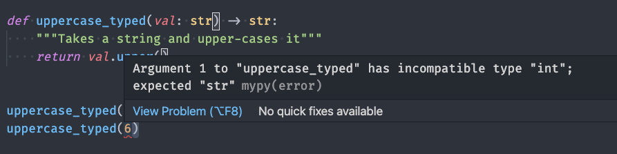

<!-- class: lead -->

# Python Type Hints
#### Python Office Hours 2021-08-09

---
<!-- class: -->

# Topics to Cover

* What is type hinting?
* What would you want to add type hints to your code?
* Basic type hinting (str, int, etc.)
* Using type checkers
* Types with parameters: Lists, Tuples & Dictionaries
* More complex types (Union, Optional, Any)
* Where to start
* Where to learn more

---
<!-- class: invert -->

# What is type hinting

```python
def graduate(name: str) -> str:
    return "Dr. " + name

entries: List[str] = []
```

* Introduced in python 3.0
* Type hints ~ structured comments about variable types, function input types, return types, etc.
* Standardized formats (as opposed to docstring comments) mean that automated type checkers can check them for consistency.
* Not required, and can be added gradually

---
# Why add type hints?
## What is this, C?

```c
int id;
double price;
```
Seems like worrying about types takes away some of the beauty and simplicity of Python.
Seems un-pythonic -- isn't python supposed to by dynamically typed?
What about duck-typing?

---
# Why add type hints?
## Catching bugs preemptively

```python
def uppercase(val):
    """Takes a string and upper-cases it"""
    return val.upper()

uppercase("hello")
uppercase(6)
```
Perfectly sytactically valid
Results in a runtime error, but it would be nice to catch it beforehand

---
# Why add type hints?
## Catching bugs preemptively



---

# Why add type hints?
## Auto-Completion
Labeling types also are available to inform your editor about the objects in question

Your editor can figure out what methods are available on an object

Example: working with `Path` objects

---
# Why add type hints?
## Better code documentation
Makes the intended use of a function or class explicit
Allows you to make your duck-typing more explicit -- what exactly am I assuming will be the characteristics of the things that are passed in & returned from this function?
* Did you just need an input that can be stringified?
* Did you need an input that has a particular method?
* Did you need something that can be iterated over?

---
# Basic type hinting (str, int, etc.)

```python
# Variables:
# not needed in this case, unless you want to make sure you don't
# accidentally reassign x to a different type
x: int = 0
x: float = 0.0  # type-checker error, because x has already been declared
y = 0  # type: int

# Parameters and return types
def fun(y: str) -> bool:
    ...

# class types
from pathlib import Path
def get_path() -> Path:
    ...
```

---
# Basic type hinting (str, int, etc.)

Which raises a type error if you run a type-checker?
```python

def fun1(x: int):
    ...

fun1(1.0)

def fun2(x: float):
    ...

fun2(1)
```

---
# Using type checkers
Go-to library: `mypy` mypy-lang.org (though others exist)
Used by extension, or automatically in editors (`python.linting.mypyEnabled = true`)
Useful for automatic checking (CI/CD) -- can check the entire codebase for consistency (every time a function is called)

```bash
pip install mypy
mypy file.py
mypy . # check all files
```

Also available as a pre-commit hook (https://github.com/pre-commit/mirrors-mypy), etc.

---
# Types with parameters: Lists, Tuples & Dictionaries

Lists can, of course, take entries with any number of values. But, if you want to know what you can do with a given object, then specifying the type of entry that will be added is helpful.

If you assume it's a list of numbers, or strings, or dictionaries, type hints let you make that assumption explicit

---
# Types with parameters: Lists

```python
from typing import List

mylist1 = [] # mypy warns that you should add a type hint
mylist2: list = []
# doesn't give any more detail than the first,
# just that it's a list of *something*
mylist3: List = []  # equivalent to the first two
mylist4: List[str] = []  # tells it it's a list of strings

# No issues with mypy
mylist3.append(str)
mylist3.append(1.2)

# mypy error
mylist4.append(4)
```
---
# Types with parameters, continued

```python
mylist4: List[str] = []

...

for item in mylist4:
    item.upper() # auto-complete works, because the editor knows what each entry is
```

---
# Types with parameters, continued

```python
from typing import Dict, Tuple

# Dictionaries
mydict1 = {} # mypy error -- should add type
mydict2: dict = {}  # same as above, but explicit
mydict3: Dict = {}  # same as above, but explicit
mydict4: Dict[str, float]  # keys are strs, values are floats

# Tuples
def get_point() -> Tuple[float, float]: # returns a tuple of 2 floats
    return 1.0, 1.0

```

---
# More complex types (Union, Optional, Any)

`Any` -- the broadest type possible (the opposite type is `object`).
Assumes that any method or property of the object does exist for typing purposes.

If possible, avoid using `Any`, but sometimes you have to (or at least have to for an initial pass)

```python
def apply_model(model: Any):
    model.get_predictions([1, 2, 3])
    model.any_arbitrary_function("hi", False) # no mypy error
```

---
# More complex types (Union, Optional, Any)

`Union` -- accepts any of a list of objects

```python
def read_from_file_path(path: Union[Path, str]):
    if isinstance(path, str): # inside this block, mypy knows this is a string
        ...
    elif isinstance(path, Path):
        ...
```

---
# More complex types (Union, Optional, Any)


```python
# These three have the same types specified in 3 different ways
def copy(directory: str, file: Union[str, None] = None):
    # Second parameter can be of type str or None
    ...

def copy2(directory: str, file: Optional[str] = None):
    # Optional[arg] == Union[arg, None]
    ...

def copy3(directory: str, file: str = None):
    # If you're defaulting a function argument to None, the
    # Optional is implied
    ...
```

---

# Where to start

* Start by adding types to new files/functions you create
* Add types to existing code you understand well
* Start with the easy cases, and handle more challenging types down the road (either by leaving types off certain things, using `Any`, or `# type: ignore` comments)

---
# Where to learn more

https://docs.python.org/3.7/library/typing.html
Note -- if you use python 3.9+, a number of things will be simplified

https://www.python.org/dev/peps/pep-0484/

#python

---

# What did we cover?
<!-- class: -->

* What is type hinting?
* What would you want to add type hints to your code?
* Basic type hinting (str, int, etc.)
* Using type checkers
* Types with parameters Lists, Tuples & Dictionaries
* More complex types (Union, Optional, Any)
* Where to start?
* Where to learn more

---

# Future Topics

* Callables & Generators
* User-Defined Types
* Generics
* Overload & Cast
* TYPE_CHECKING
* Mypy settings
* Libraries that take advantage of type hints (FastAPI, Typer, etc.)
* Future of type hints