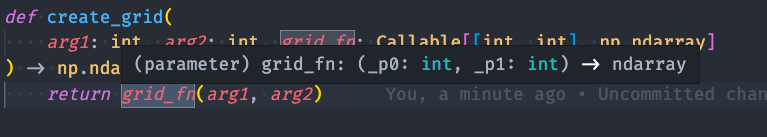

<!-- class: lead -->

# Python Type Hints

#### SLOSH 💦

#### 2022-11-18

---

<!-- class: -->

# Topics to Cover

- The What and Why of type hints
- Basic type hinting (str, int, etc.)
- Using type checkers
- More complex types
- List-like types
- Nicer NamedTuples
- User-Defined Type Aliases
- Generics
- Where to start

---

<!-- class: invert -->

# What is type hinting

```python
def graduate(name: str) -> str:
    return "Dr. " + name

entries: List[str] = []
```

- Introduced in python 3.0
- Type hints ~ structured comments about variable types, function input types, return types, etc.
- Standardized formats (as opposed to docstring comments) mean that automated type checkers can check them for consistency.
- Not required, and can be added gradually

---

# Why add type hints?

## What is this, C?

```c
int id;
double price;
```

Seems like worrying about types takes away some of the beauty and simplicity of Python.
Seems un-pythonic -- isn't python supposed to by dynamically typed?
What about duck-typing?

---

# Why add type hints?

## Catching bugs preemptively

```python
def uppercase(val):
    """Takes a string and upper-cases it"""
    return val.upper()

uppercase("hello")
uppercase(6)
```

Perfectly sytactically valid
Results in a runtime error, but it would be nice to catch it beforehand

---

# Why add type hints?

## Catching bugs preemptively


---

# Why add type hints?

## Auto-Completion

Labeling types also are available to inform your editor about the objects in question

Your editor can figure out what methods are available on an object

Example: working with `Path` objects

---

# Why add type hints?

## Better code documentation

Makes the intended use of a function or class explicit
Allows you to make your duck-typing more explicit -- what exactly am I assuming will be the characteristics of the things that are passed in & returned from this function?

- Did you just need an input that can be stringified?
- Did you need an input that has a particular method?
- Did you need something that can be iterated over?

---

# Basic type hinting (str, int, etc.)

```python
# Variables:
# not needed in this case, as mypy will likely
# accidentally reassign x to a different type
x: int = 0
x: float = 0.0  # type-checker error, because x has already been declared
y = 0  # type: int

# Parameters and return types
def fun(y: str) -> bool:
    ...

# class types
from pathlib import Path
def get_path() -> Path:
    ...
```

---

# Basic type hinting (str, int, etc.)

Which raises a type error if you run a type-checker?

```python

def fun1(x: int):
    ...

fun1(1.0)

def fun2(x: float):
    ...

fun2(1)
```

---

# Using type checkers

`mypy`

- The official python option (Guido himself on the team)
- In vscode: `"python.linting.mypyEnabled": "true"`

`pyright`

- Microsoft alternative
- Meant to be faster to run, fix bugs faster, but smaller community
- Built into vscode through pylance `"python.analysis.typeCheckingMode": "basic"`

---

# Using type checkers

Both be run locally, via pre-commit, CI/CD, etc.

```bash
pip install mypy
mypy file.py
mypy . # check all files
```

---

# Types with parameters: Lists, Tuples & Dictionaries

Lists can, of course, take entries with any number of values. But, if you want to know _what you can do with a given object_, then specifying the type of entry that will be added is helpful.

If you assume it's a list of _numbers_, or _strings_, or _dictionaries_, type hints let you **make that assumption explicit**

---

# Types with parameters: Lists

```python
from typing import List

mylist1 = [] # mypy warns that you should add a type hint
mylist2: list = []
# doesn't give any more detail than the first,
# just that it's a list of *something*, but make mypy happy
mylist3: List = []  # equivalent to the first two
mylist4: List[str] = []  # tells it it's a list of strings

# No issues with mypy
mylist3.append(str)
mylist3.append(1.2)

# mypy error
mylist4.append(4)
```

---

# Types with parameters, continued

```python
mylist4: List[str] = []

...

for item in mylist4:
    item.upper() # auto-complete works, because the editor knows what each entry is
```

---

# Types with parameters, continued

```python
from typing import Dict, Tuple

# Dictionaries
mydict1 = {} # mypy error -- should add type
mydict2: dict = {}  # same as above, but explicit
mydict3: Dict = {}  # same as above, but explicit
mydict4: Dict[str, float]  # keys are strs, values are floats

# Tuples
def get_point() -> Tuple[float, float]: # returns a tuple of 2 floats
    return 1.0, 1.0

```

---

# Types with parameters, continued

In python >=3.9, `from typing import List, Dict, Tuple` is no longer necessary, as the built-in `list`, `dict` and `tuple` types are now subscriptable.

```python
items: list[str] = []

def get_stuff() -> tuple[int, str, float]:
    ...
```

---

# More complex types (Union, Optional, Any)

`Any` -- the broadest type possible (the opposite type is `object`).
Assumes that any method or property of the object does exist for typing purposes.

If possible, avoid using `Any`, but sometimes you have to (or at least have to for an initial pass)

```python
def apply_model(model: Any):
    model.get_predictions([1, 2, 3])
    model.any_arbitrary_function("hi", False) # no mypy error
```

---

# More complex types (Union, Optional, Any)

`Union` -- accepts any of a list of types

```python
def read_from_file_path(path: Union[Path, str]):
    if isinstance(path, str): # inside this block, mypy knows this is a string
        ...
    elif isinstance(path, Path):
        ...
```

In python >= 3.10, you can use `|` instead of `Union`

```python
def read_from_file_path(path: Path | str):
```

---

# More complex types (Union, Optional, Any)

```python
# These three have the same types specified in 3 different ways
def copy(directory: str, file: Union[str, None] = None):
    # Second parameter can be of type str or None
    ...

def copy2(directory: str, file: Optional[str] = None):
    # Optional[arg] == Union[arg, None]
    ...

# Only in python >=3.10
def copy3(directory: str, file: str | None = None):
    ...
```

---

# Callables & Generators

`Callable[[list_of_argument_types], return_type]`

```python
from typing import Callable

# Note: the Callable's None is required
def apply_transform(df: pd.DataFrame, transform: Callable[[pd.DataFrame], None]):
    transform(df)

def fetch_data(fetcher: Callable[..., pd.DataFrame], **kwargs) -> pd.DataFrame:
    return fetcher(**kwargs)

def create_grid(arg1: int, arg2: int, grid_fn: Callable[[int, int], np.ndarray]) -> np.ndarray:
    return grid_fn(arg1, arg2)
```

---

# Callables & Generators

Informing the editor:



Adding this annotation allows the editor to intelligently describe what can be passed into this function.

---

# Callables & Generators

`Generator[YieldType, SendType, ReturnType]`

Much of the time, your generators probably have only a YieldType

```python
def add_values(gen: Generator[int, None, None]) -> int:
    return sum(gen)
```

In this case, `Iterator` is probably the best choice (more on this later)

```python
def add_values2(gen: Iterator[int]) -> int:
    return sum(gen)
```

---

# List-like Types (Better Duck-Typing)

```python
from typing import List, Sequence, Iterable, Tuple, Set

def double_things(list_like_thing): # type: ???
    for i in thing:
        i *= 2
        ...
```

Should any of these be a type-error?

```
double_things([1,2,3])
double_things((1,2,3))
double_things({1,2,3})
double_things("123")
```

---

# List-like Types (Better Duck-Typing)

- Do you just need it to work in `for` loop? Use `Iterable`
- Will you be `len(arg)` or `arg[23]`? Use `Sequence`.
- Will you be using `arg.reverse()`, `arg.append()`? Use `List`.

Why not just always use `List`, since it has all of these features?

What if someone passes a tuple? Should it work? Will it work?

Makes your assumptions more explicit -- yes, it's list-like, but how?

---

# List-like Types (Better Duck-Typing)

Similarly with dictionaries:

- Do you just need something that maps? `Mapping`
- What if you need to change/add items? `MutableMapping`

(Probably not as important as using generic types for `list`-like variables)

---

# Nicer NamedTuples (>=3.6)

```python
from collections import namedtuple

Point = namedtuple('Point', ['x', 'y'], defaults=[0, 0])

a = Point(2.0, 3.0)
b = Point(x=3.3, y=4.5)
c = Point()

assert a.x == a[0]
assert repr(a) == "Point(x=2.0, y=3.0)"
assert repr(c) == "Point(x=0, y=0)"
```

---

# Nicer NamedTuples

```python
from typing import NamedTuple

class Point(NamedTuple):
    x: float = 0
    y: float = 0

a = Point(2.0, 3.0)
b = Point(x=3.3, y=4.5)
c = Point()
assert a.x == a[0]
assert repr(a) == "Point(x=2.0, y=3.0)"
assert repr(c) == "Point(x=0, y=0)"
```

Which one makes you happier?

---

# User-Defined Type Aliases

If

- you find yourself using a particular complicated type regularly (e.g. `Dict[Union[str, int], Callable...]`), or
- a type has a particular meaning in this code context (e.g. this type of dictionary always represents model options),

it can be helpful to define a custom name/alias for that type.

```python
ModelOptionsType = Dict[Union[str, int], Union[int, np.ndarray]]

def create_model(options: ModelOptionsType) -> ...
```

---

# User-Defined Type Aliases

An Example from `pandas._typing`

```python
PythonScalar = Union[str, int, float, bool]
DatetimeLikeScalar = Union["Period", "Timestamp", "Timedelta"]
PandasScalar = Union["Period", "Timestamp", "Timedelta", "Interval"]
Scalar = Union[PythonScalar, PandasScalar]
```

---

# Generics

Types like `List`, `Dict`, etc. are Generic container types, which can be containers made up of any different type of object.

You can define your own generic types, which can be used as types, and with `[]` syntax. More importantly, they can be used to create custom classes which use the `[]` sytax.

---

# Generics

These generic types can be used with collections

```python
Item = TypeVar('Item')

def first(items: Sequence[Item]) -> Item:
    return items[0]
```

---

# Generics

```python
StringableType = TypeVar("StringableType")

class StringableThing(Generic[StringableType]):
    def __init__(self, val: StringableType) -> None:
        self.val = val

    def get_val(self) -> StringableType:
        return self.val

    def stringify(self) -> str:
        return str(self.val)

a_thing: StringableThing[int] = StringableThing(7)
a_thing.get_val()
another_thing: StringableThing[str] = StringableThing("hello")
another_thing.get_val()
```

---

# Generics

Generic types can be constrained

```python
DoublableType = TypeVar("DoublableType", int, float, List, str)

class Doubler(Generic[DoublableType]):
    def __init__(self, val: DoublableType) -> None:
        self.val: DoublableType = val

    def double(self) -> DoublableType:
        return self.val * 2

item1: Doubler[int] = Doubler(27)
item2: Doubler[str] = Doubler("a string")
```

---

# Generics

More practical example

```python
ContentType = TypeVar("ContentType", str, bytes)

class S3Object(Generic[ContentType]):
    def __init__(self, key: str) -> None:
        self.key = key

    def get_contents(self) -> ContentType:
        ...

def apply_model(model: S3Object[bytes], model_options: S3Object[str]):
    ...
```

---

# Where to start

- Start by adding types to new files/functions you create
- Add types to existing code you understand well
- Start with the easy cases, and handle more challenging types down the road (either by leaving types off certain things, using `Any`, or `# type: ignore` comments)

---

# Where to learn more

https://docs.python.org/3/library/typing.html

https://www.python.org/dev/peps/pep-0484/

---

# What did we cover?

<!-- class: -->

- The What and Why of type hints
- Basic type hinting (str, int, etc.)
- Using type checkers
- More complex types
- List-like types
- Nicer NamedTuples
- User-Defined Type Aliases
- Generics
- Where to start

---

# Questions?
