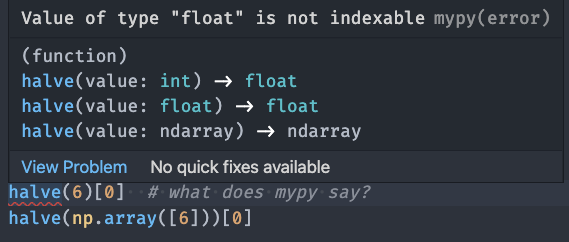
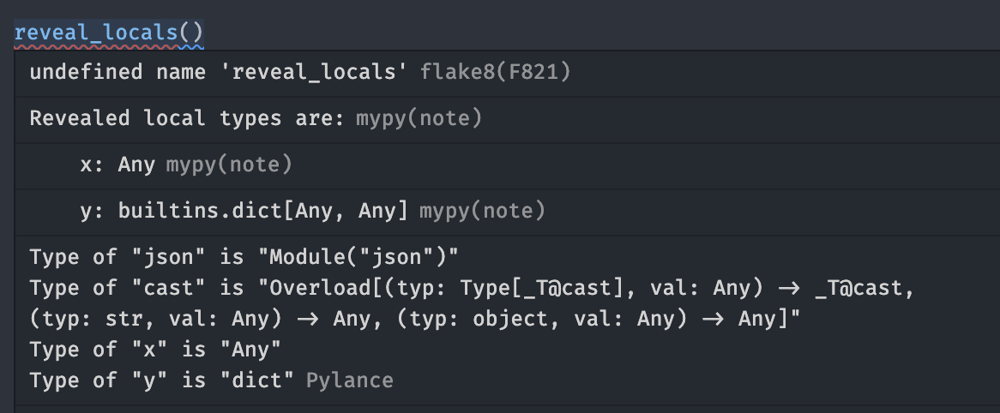

<!-- class: lead -->

# Python Type Hints, Part 3
#### Python Office Hours 2021-09-27

---
<!-- class: -->

# Topics to Cover

* Overload & Cast
* TYPE_CHECKING
* Mypy debugging
* Mypy settings
* Libraries that take advantage of type hints (FastAPI, Typer, etc.)
* Future of type hints

---
<!-- class: invert -->

# Overload & Cast

```python
from typing import overload

@overload
def halve(value: int) -> float:
    pass
@overload
def halve(value: float) -> float:
    pass
@overload
def halve(value: np.ndarray) -> np.ndarray:
    pass
def halve(value):
    return value / 2

halve(6)[0] # what does mypy say?
halve(np.array([6]))[0]
```

---
# Overload & Cast



Note that this is just *type* overloading, and doesn't allow for actual function logic overloading. For a single argument of changing type, see [functools.singledispatch](https://docs.python.org/3/library/functools.html#functools.singledispatch).

---
# Overload & Cast

```python
def load_json(path: str) -> Union[dict, list]:
    with open(path) as f:
        return json.load(f)

data = load_json("model_options.json")
data.items()
```

What's the problem with this?

---
# Overload & Cast

`cast` ~ the inverse of `overload`

```python
data = cast(dict, load_json("model_options.json"))
data.items()

events = cast(list, load_json("events.json"))
events.reverse()
```

Note: cast is essentially just a type hint, it doesn't actually do anything, but just returns the second argument, as far as python is concerned

---
# TYPE_CHECKING

If there are things that you want to import for type hinting purposes, but don't really need them otherwise, use `TYPE_CHECKING`

```python
if TYPE_CHECKING:
    from external_module_just_for_type_hints import Thing
else:
    Thing = Any

def get_thing() -> Thing:
    ...
```

---
# TYPE_CHECKING

Alternatively, use `""`s, and mypy will figure out what you mean

```python
if TYPE_CHECKING:
    from external_module_just_for_type_hints import Thing

def get_thing() -> "Thing":
    ...
```

---
# TYPE_CHECKING

This `""` notation is also commonly used when you need to reference a class you haven't yet defined, by the way

```python
class A:
    def get_thing(self) -> B: # raises a NameError
        ...

class A2:
    def get_thing(self) -> "B": # No error
        ...

class B:
    ...
```
---
# Mypy Debugging

Mypy comes with two magic functions that can be handy for setting exactly what mypy things the types of certain objects are:
* `reveal_type(obj)`
* `reveal_locals()`

Note that these are not valid python, and are only understood by mypy, and if you leave them in your final code they will cause `NameError`'s -- they are just for debugging purposes

---
# Mypy Debugging

```python
x = json.loads("[1,2,3]")
reveal_type(x) # Revealed type is "Any"
y = cast(dict, x)
reveal_type(y) # Revealed type is "builtins.dict[Any, Any]"
reveal_locals()
# Revealed local types are:
#    x: Anymypy(note)
#    y: builtins.dict[Any, Any]
```

Can see the output with `mypy filename.py` or inside of IDE

---
# Mypy Debugging



Note: you can get the same info from Pylance just by hovering over a variable in vscode

---

# Mypy Settings

There are many customizable settings, which can be passed on the command line, or set in a config file (`mypy.ini` or `pyproject.toml`).

Some useful ones:

* `--strict`
* `--follow-imports=silent` (not recommended, but perhaps useful for adding types to large existing codebases)
* `--exclude bad_files/`
* `--install-types`
---
# Mypy Settings

https://mypy.readthedocs.io/en/stable/command_line.html
https://mypy.readthedocs.io/en/stable/config_file.html

---
# Libaries that use Type Hints: Typer

```python
# main.py
import typer

def main(name: str, english: bool = True):
    if english is True:
        print(f"Hello {name}")
    else:
        print(f"Hola {name}")

if __name__ == "__main__":
    typer.run(main)
```

---
# Libaries that use Type Hints: Typer

```bash
> python -m main --help
Usage: python -m main [OPTIONS] NAME

Arguments:
  NAME  [required]

Options:
  --english / --no-english        [default: english]
  --install-completion [bash|zsh|fish|powershell|pwsh]
                                  Install completion for the specified shell.
  --show-completion [bash|zsh|fish|powershell|pwsh]
                                  Show completion for the specified shell, to
                                  copy it or customize the installation.
  --help                          Show this message and exit.
```

---
# Libaries that use Type Hints: FastAPI

```python
from typing import Optional

from fastapi import FastAPI

app = FastAPI()

# Visiting / -> {hello: world}
@app.get("/")
def read_root():
    return {"Hello": "World"}

# Can visit /items/6, or /items/6/q=something
@app.get("/items/{item_id}")
def read_item(item_id: int, q: Optional[str] = None):
    return {"item_id": item_id, "q": q}
```

---
# Libraries that use Type Hints: PyDantic

```python
from pydantic import BaseModel

class User(BaseModel):
    id: int
    name = 'John Doe'
    signup_ts: Optional[datetime] = None
    friends: List[int] = []

# Raises ValidationError with detailed message of the issues
User(signup_ts='broken', friends=[1, 2, 'not number'])
```

---
# Future of type hints

Typed Dictionaries (Python >= 3.8)

```python
class Point2D(TypedDict):
    x: int
    y: int
    label: str
```

Just a dictionary, but mypy knows how to check for the right keys and value types

---
# Future of type hints

Literals (Python >= 3.8)

```python
from typing import Literal

MODE = Literal['r', 'rb', 'w', 'wb']
def open_helper(file: str, mode: MODE) -> str:
    ...

open_helper('/some/path', 'r')
open_helper('/other/path', 'typo')  # MyPy error
```
---
# Future of type hints

Annotation built-in types (Python >= 3.9)

```python
# no more "from typing import Dict, List"
x: dict[str, Any] = {}
y: list[bool] = []
```
---

# Future of type hints

`|` instead of `Union` (Python >= 3.10)

```python
def open_file(path: str | Path) -> str | bytes:
    ...
```
---
# Future of type hints

Typed Dictionaries with Required/NotRequired (Python >= 3.10)

```python
from typing import TypedDict, NotRequired, Required
class Point2D(TypedDict):
    x: int
    y: int
    label: NotRequired[str]

class Person(TypedDict, total=False):
    first_name: Required[str]
    last_name: Required[str]
    title: str
```

---
# What did we cover?
<!-- class: -->

* Overload & Cast
* Not-yet-defined types
* TYPE_CHECKING
* Mypy Debugging
* Mypy settings
* Libraries that take advantage of type hints (FastAPI, Typer, etc.)
* Future of type hints
---

# Future Topics

* ???
